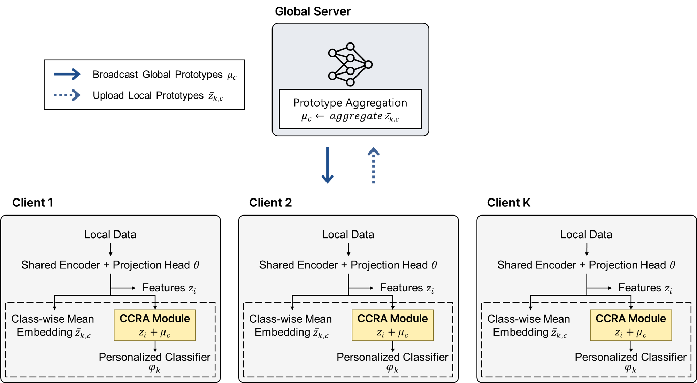
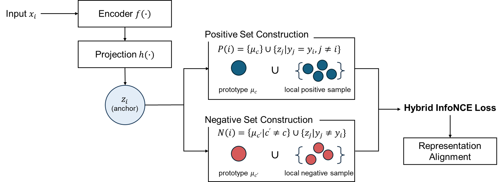

# FedRAPT: Federated Representation-Aligned Prototypical Contrastive Learning

<p align="center">
  <strong>Personalized federated learning for non-IID Human Activity Recognition</strong>
</p>

---

## Overview

FedRAPT is a personalized federated learning framework for wearable sensor-based Human Activity Recognition (HAR) under statistical heterogeneity. It jointly performs cross-client class-level alignment, local sample discrimination, and client-specific personalization — without sharing raw data.

---

## Main Contributions

- **Cross-client class alignment** — global class prototypes provide consistent representation anchors across clients, reducing inter-client inconsistency.
- **Sample-level discrimination** — local InfoNCE loss preserves fine-grained discriminative relationships within each client.
- **Personalized prediction** — a local FC classifier adapts to each client's data distribution and is never aggregated.
- **Stable prototype management** — EMA-based prototype update reduces fluctuations under partial participation and non-IID distributions.

---

## Framework

FedRAPT operates over multiple communication rounds. In each round, the server distributes a shared model and global class prototypes to selected clients. Each client performs local training using both cross-entropy and contrastive loss, then returns the updated shared parameters and class-wise mean embeddings. The server aggregates parameters via FedAvg and refreshes prototypes via EMA. The personalized classifier and raw data never leave the client.

<p align="center">
  
  <br/><em>Overall FedRAPT framework</em>
</p>

<br><br>

The core of FedRAPT is the **Cross-Client Representation Alignment (CCRA)** module. Each client computes contrastive loss using global class prototypes as cross-client anchors alongside local batch samples. Same-class prototypes and local embeddings form the positive set; different-class prototypes and local embeddings form the negative set. This structure aligns representations across clients while preserving local discriminability.

<p align="center">
  
  <br/><em>Cross-Client Representation Alignment (CCRA) module</em>
</p>

<br><br>

---

## Method

### Model Architecture

```
Input (batch, 128, F)
        │
   ┌────▼────┐
   │  LSTM   │  ← shared, aggregated via FedAvg
   └────┬────┘
        │ 64-dim representation
   ┌────┴──────────────────┐
   │                       │
┌──▼──────────┐     ┌──────▼──────┐
│  Projection │     │  Classifier │
│    Head     │     │    (FC)     │  ← local only, never aggregated
└──┬──────────┘     └──────┬──────┘
   │ normalized             │ logits
   │ embedding              │
   ▼                        ▼
InfoNCE loss (CCRA)      CE loss
```

| Module              | Function                                                               | Sharing Scope   |
| ------------------- | ---------------------------------------------------------------------- | --------------- |
| **LSTM encoder**    | Extracts a 64-dimensional representation from a 128-step sensor window | Globally shared |
| **Projection head** | Maps representations to a normalized 64-dimensional contrastive space  | Globally shared |
| **FC classifier**   | Learns a client-specific activity decision boundary                    | Local only      |

### Training Objective

Each client minimizes:

```math
\mathcal{L}_{\mathrm{total}}
=
\mathcal{L}_{\mathrm{CE}}
+
\lambda \mathcal{L}_{\mathrm{CL}}
```

- $\mathcal{L}_{\mathrm{CE}}$: local classification loss
- $\mathcal{L}_{\mathrm{CL}}$: CCRA-based contrastive loss
- $\lambda$: contrastive loss weight (default: 0.5)

### Cross-Client Representation Alignment (CCRA)

For each anchor embedding, CCRA constructs positive and negative sets from both global prototypes and local batch samples:

| Set          | Included elements                                                  |
| ------------ | ------------------------------------------------------------------ |
| **Positive** | Same-class global prototype + same-class local samples             |
| **Negative** | Different-class global prototypes + different-class local samples  |

### Global Prototype Update

After local training, each client sends class-wise mean embeddings to the server. The server updates global prototypes using exponential moving average:

```math
\mu_c^{t+1}
=
\beta \mu_c^t
+
(1-\beta)
\left(
\frac{1}{K_c}
\sum_k z_{k,c}
\right)
```

where $\beta=0.9$, $z_{k,c}$ is the mean embedding of class $c$ on client $k$, and $K_c$ is the number of participating clients containing class $c$.

---

## Repository Structure

```
FedRAPT/
├── main.py                          # Entry point: federated training loop
├── args.py                          # Argument parser and defaults
├── utils.py                         # Seed fixing, arg logging, checkpoint save/load
├── run.sh                           # Single-dataset runner
├── run_prototype_experiments.sh     # Prototype strategy ablation
│
├── federation/
│   ├── server.py                    # FedAvg aggregation + EMA prototype update
│   └── client.py                    # Local training (CE + InfoNCE) + evaluation
│
├── models/
│   ├── lstm.py                      # LSTM encoder + projection head + FC classifier
│   └── contrastive.py               # InfoNCE loss, prototype utilities
│
├── data/
│   ├── loader.py                    # .npz → DataLoader (70/15/15 split)
│   └── preprocess.py                # Raw datasets → per-client .npz files
│
├── configs/                         # Per-dataset reference hyperparameters
├── scripts/
│   ├── run_all.sh                   # Reproduce all 5 datasets × 5 runs
│   └── summarize_results.py         # Print results table from saved CSVs
├── figures/
├── result/                          # Created at runtime — metrics CSVs
├── checkpoints/                     # Created at runtime — model weights
└── requirements.txt
```

---

## Requirements

```bash
pip install torch==2.4.0 torchvision==0.19.0 torchaudio==2.4.0 \
    --index-url https://download.pytorch.org/whl/cu118

pip install -r requirements.txt
```

Tested on Python 3.10, PyTorch 2.4.0, CUDA 11.8.

---

## Dataset Preparation

### Download

| Dataset     | Clients | Classes | Sensor Input                 | Link |
| ----------- | ------- | ------- | ---------------------------- | ---- |
| WISDM v1.1  | 36      | 6       | Accelerometer (x, y, z)      | [Download](https://www.cis.fordham.edu/wisdm/dataset.php) |
| UCI-HAR     | 30      | 6       | Total acceleration (x, y, z) | [Download](https://archive.ics.uci.edu/dataset/240/human+activity+recognition+using+smartphones) |
| MotionSense | 24      | 6       | Total acceleration (x, y, z) | [Download](https://github.com/mmalekzadeh/motion-sense) |

### Preprocessing

| Dataset     | Preprocessing |
| ----------- | ------------- |
| WISDM       | Raw 20 Hz signals upsampled to 50 Hz via linear interpolation; sliding window (128 steps, stride 64) |
| MotionSense | Sliding window (128 steps, stride 64) |
| UCI-HAR     | Pre-segmented 128-step windows provided by the dataset |

```bash
# WISDM
python data/preprocess.py --dataset wisdm \
    --data_dir /path/to/WISDM_ar_v1.1_raw.txt \
    --output_dir ./data/wisdm_npz

# UCI-HAR (natural split)
python data/preprocess.py --dataset ucihar \
    --data_dir /path/to/UCI_HAR_Dataset \
    --output_dir ./data/ucihar_npz

# UCI-HAR Dirichlet α=0.1
python data/preprocess.py --dataset ucihar \
    --data_dir /path/to/UCI_HAR_Dataset \
    --output_dir ./data/ucihar_npz_alpha01 \
    --dirichlet --alpha 0.1 --seed 42

# UCI-HAR Dirichlet α=0.5
python data/preprocess.py --dataset ucihar \
    --data_dir /path/to/UCI_HAR_Dataset \
    --output_dir ./data/ucihar_npz_alpha05 \
    --dirichlet --alpha 0.5 --seed 42

# MotionSense
python data/preprocess.py --dataset motionsense \
    --data_dir /path/to/A_DeviceMotion_data \
    --output_dir ./data/motionsense_npz
```

Each output file is a `.npz` with keys `X` (N, 128, 3) and `y` (N,) int64.

---

## Experimental Setup

### Data Partitioning

| Dataset Setting   | Split Type | Description |
| ----------------- | ---------- | ----------- |
| WISDM             | Natural    | Each of 36 users forms one client |
| UCI-HAR (natural) | Natural    | Each of 30 subjects forms one client |
| UCI-HAR (α=0.1)   | Dirichlet  | Extreme non-IID; Max/Min sample ratio ~234×, avg 3.4 classes/client |
| UCI-HAR (α=0.5)   | Dirichlet  | Moderate non-IID; Max/Min ~6.5×, avg 5.6 classes/client |
| MotionSense       | Natural    | Each of 24 subjects forms one client |

Train/Val/Test split per client: **70% / 15% / 15%**, using a deterministic SHA-256 seed derived from the client name.

### Hyperparameters

| Parameter              | Value       | Description |
| ---------------------- | ----------- | ----------- |
| Communication rounds   | 100         | |
| Local epochs           | 3           | |
| Batch size             | 50          | |
| Learning rate          | 0.01        | SGD with momentum 0.9 |
| λ (contrastive weight) | 0.5         | InfoNCE loss weight |
| τ (temperature)        | 0.07        | InfoNCE temperature |
| β (EMA momentum)       | 0.9         | Prototype update |
| Projection dim         | 64          | |
| LSTM hidden size       | 64          | |
| Clients per round      | 12 / 10 / 8 | WISDM / UCI-HAR / MotionSense |

---

## Usage

```bash
# Single run
bash run.sh wisdm
bash run.sh ucihar
bash run.sh ucihar_01        # UCI-HAR α=0.1
bash run.sh ucihar_05        # UCI-HAR α=0.5
bash run.sh motionsense

# 5 independent runs
bash run.sh ucihar_01 --runs 5

# Custom settings
bash run.sh ucihar_01 --runs 5 --global_rounds 100 --local_epochs 3 --seed 42
```

Or run directly:

```bash
python main.py \
    --dataset ucihar \
    --data_dir ./data/ucihar_npz_alpha01 \
    --r 100 --E 3 --B 50 \
    --clients_per_round 10 \
    --seed 42 \
    --metrics_csv result/ucihar_alpha01/fedrapt_metrics_iter1.csv
```

---

## Main Results

Mean ± std over 5 independent runs (personalized accuracy at round 100):

| Dataset           | Accuracy (↑)     | F1 Score (↑)     | Loss (↓)          | Forgetting Rate (↓) |
| ----------------- | ---------------- | ---------------- | ----------------- | ------------------- |
| WISDM             | 96.30 ± 0.54     | 96.21 ± 0.59     | 0.118 ± 0.020     | 0.011 ± 0.003       |
| UCI-HAR (natural) | 96.13 ± 0.24     | 96.04 ± 0.28     | 0.117 ± 0.008     | 0.011 ± 0.002       |
| UCI-HAR (α=0.1)   | 96.09 ± 0.61     | 95.99 ± 0.68     | 0.120 ± 0.019     | 0.012 ± 0.004       |
| UCI-HAR (α=0.5)   | 94.42 ± 4.78     | 93.84 ± 5.90     | 0.168 ± 0.121     | 0.024 ± 0.036       |
| MotionSense       | 94.00 ± 1.92     | 93.65 ± 2.29     | 0.193 ± 0.057     | 0.016 ± 0.005       |

---

## Additional Analysis

### Prototype Update Strategy (UCI-HAR α=0.1)

| Strategy             | Accuracy (↑)         | F1 (↑)               | Loss (↓)              | Forgetting Rate (↓)   |
| -------------------- | -------------------- | -------------------- | --------------------- | --------------------- |
| Direct               | 87.02 ± 1.13         | 84.13 ± 1.22         | 0.355 ± 0.030         | 0.019 ± 0.006         |
| Simple Average       | 86.89 ± 2.65         | 83.99 ± 2.97         | 0.365 ± 0.071         | 0.031 ± 0.018         |
| Cumulative           | 86.71 ± 2.66         | 83.88 ± 3.45         | 0.394 ± 0.060         | 0.031 ± 0.021         |
| **EMA β=0.9 (Ours)** | **96.09 ± 0.61**     | **95.99 ± 0.68**     | **0.120 ± 0.019**     | **0.012 ± 0.004**     |

### Component Ablation

<table>
  <thead>
    <tr>
      <th>Dataset</th>
      <th>Method</th>
      <th>Accuracy (↑)</th>
      <th>F1 Score (↑)</th>
      <th>Loss (↓)</th>
      <th>Forgetting Rate (↓)</th>
    </tr>
  </thead>
  <tbody>
    <tr>
      <td rowspan="5"><strong>WISDM</strong></td>
      <td>w/o All</td>
      <td>93.33 ± 1.82</td>
      <td>92.99 ± 2.06</td>
      <td>0.179 ± 0.039</td>
      <td>0.013 ± 0.001</td>
    </tr>
    <tr>
      <td>w/o Per</td>
      <td>96.05 ± 1.56</td>
      <td>95.88 ± 1.73</td>
      <td>0.125 ± 0.048</td>
      <td>0.020 ± 0.013</td>
    </tr>
    <tr>
      <td>w/o P</td>
      <td>89.99 ± 15.16</td>
      <td>88.54 ± 18.22</td>
      <td>0.274 ± 0.371</td>
      <td>0.032 ± 0.055</td>
    </tr>
    <tr>
      <td>w/o CCRA</td>
      <td>87.13 ± 14.91</td>
      <td>85.31 ± 18.04</td>
      <td>0.337 ± 0.341</td>
      <td>0.045 ± 0.071</td>
    </tr>
    <tr>
      <td><strong>Proposed</strong></td>
      <td><strong>96.30 ± 0.54</strong></td>
      <td><strong>96.21 ± 0.59</strong></td>
      <td><strong>0.118 ± 0.020</strong></td>
      <td><strong>0.011 ± 0.003</strong></td>
    </tr>
    <tr>
      <td rowspan="5"><strong>UCI HAR α=0.1</strong></td>
      <td>w/o All</td>
      <td>76.17 ± 7.84</td>
      <td>71.84 ± 8.97</td>
      <td>0.673 ± 0.227</td>
      <td>0.073 ± 0.073</td>
    </tr>
    <tr>
      <td>w/o Per</td>
      <td>86.78 ± 2.34</td>
      <td>85.10 ± 2.55</td>
      <td>0.375 ± 0.053</td>
      <td>0.040 ± 0.011</td>
    </tr>
    <tr>
      <td>w/o P</td>
      <td>81.78 ± 1.17</td>
      <td>78.10 ± 1.42</td>
      <td>0.506 ± 0.019</td>
      <td>0.026 ± 0.008</td>
    </tr>
    <tr>
      <td>w/o CCRA</td>
      <td>75.18 ± 2.98</td>
      <td>69.69 ± 3.82</td>
      <td>0.639 ± 0.076</td>
      <td>0.067 ± 0.019</td>
    </tr>
    <tr>
      <td><strong>Proposed</strong></td>
      <td><strong>96.09 ± 0.61</strong></td>
      <td><strong>95.99 ± 0.68</strong></td>
      <td><strong>0.120 ± 0.019</strong></td>
      <td><strong>0.012 ± 0.004</strong></td>
    </tr>
  </tbody>
</table>

---

## Computational and Memory Overhead

FedRAPT transmits only the shared encoder and projection head parameters per round. The personalized classifier and raw sensor data never leave the client.

Per round, each selected client uploads:
- Shared model parameters (LSTM encoder + projection head)
- Class-wise mean embeddings (one 64-dimensional vector per class)

Communication cost per round is automatically logged to `*_comm.csv`.

---

## Reproducibility

All results are reported as **mean ± std over 5 independent runs**.

- Train/Val/Test splits are determined per client using a SHA-256 seed derived from the client name, ensuring consistency across runs regardless of the global seed.
- To fix the global random seed across all other operations: `--seed 42`
- If `--seed` is omitted, the run uses random initialization.

To reproduce all experiments:

```bash
export DATA_WISDM=./data/wisdm_npz
export DATA_UCIHAR=./data/ucihar_npz
export DATA_UCIHAR_01=./data/ucihar_npz_alpha01
export DATA_UCIHAR_05=./data/ucihar_npz_alpha05
export DATA_MOTIONSENSE=./data/motionsense_npz

bash scripts/run_all.sh
python scripts/summarize_results.py
```

Output files:

```
result/
└── ucihar_alpha01/
    ├── fedrapt_metrics_iter1.csv          # Per-client, per-round metrics
    ├── fedrapt_metrics_iter1_comm.csv     # Communication cost per round
    └── fedrapt_metrics_iter1_config.json  # Full args + date

checkpoints/
└── ucihar_alpha01/
    └── run1/
        ├── global_final.pth               # Global encoder weights
        └── user_1_windows_final.pth       # Per-client personalized model
```

---

## Code Availability

The source code is publicly available at: https://github.com/seosubin7/FedRAPT

---

## Citation

If you use this code, please cite:

```bibtex
@article{fedrapt2025,
  title   = {FedRAPT: Federated Representation-Aligned Prototypical Contrastive Learning},
  author  = {Su-Bin Seo and Jong-Hoon Kim and Chang-Sun Shin and Han-Sung Lee and Chun-Bo Sim and Se-Hoon Jung},
  year    = {2025}
}
```

---

## Contact

For questions or feedback, please open an issue or contact:

- **Subin Seo** — tnqls8465@naver.com
  Sunchon National University, Department of Computer Engineering, Suncheon, 57922, Korea

**Corresponding authors:**

- **Se-Hoon Jung** — shjung@scnu.ac.kr
  Sunchon National University, Department of Computer Engineering, Suncheon, 57922, Korea

- **Chun-Bo Sim** — cbsim@scnu.ac.kr
  Sunchon National University, Interdisciplinary Program in IT-Bio Convergence System, Suncheon, 57922, Korea
